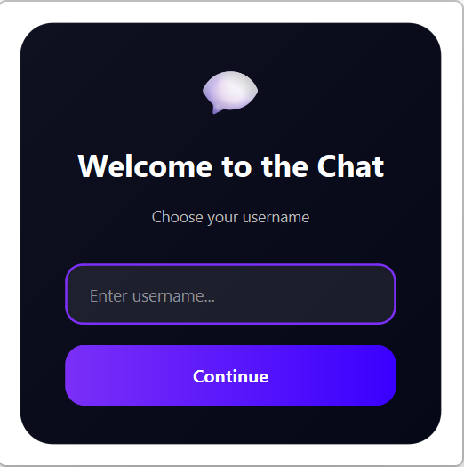
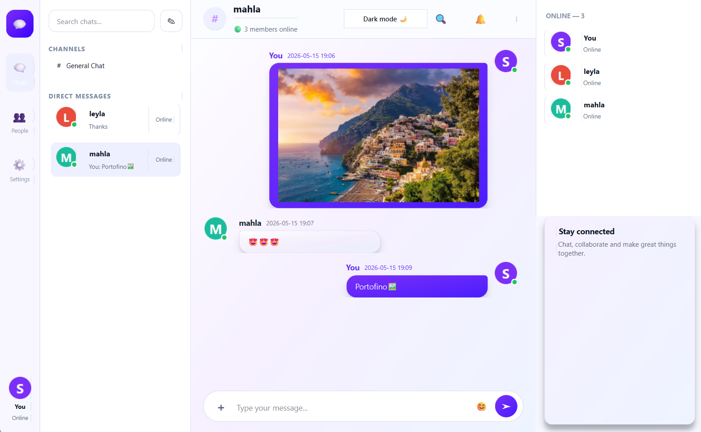
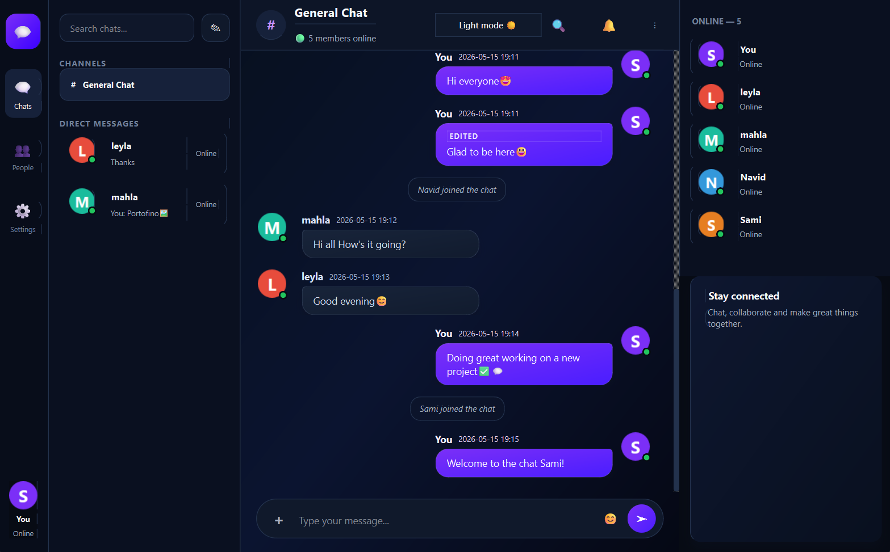

## 🖼️ Screenshots

### Sign‑in dialog


### Light theme – private chat


### Dark theme – group chat


# Multi‑Phase Socket Messenger Project

**A progressive Python socket programming project**  
**From basic console chat to a GUI messenger with database & Docker**

---

## 📜 Overview

This repository contains a multi‑phase network programming project that gradually evolves from a **simple TCP chat** into a **full messenger application** with:

- multi‑client support  
- command‑based console features  
- GUI with PySide6  
- private messaging  
- database persistence  
- Dockerized deployment  

The phases are:

- `phase-1` – Basic socket chat (single‑room console chat)  
- `phase-2` – Multi‑client console chat  
- `phase-2-Advanced` – Extended console features  
- `phase-3` – Command‑driven console chat with logging  
- `phase-4` – Final MessengerApp with GUI, database & Docker  

---

## ✨ Features

### Common network features

- TCP‑based client–server architecture
- JSON / text‑based protocol over sockets
- Broadcast messages to all connected clients
- Username‑based user management

### Phase‑specific highlights

- **Phase 1**
  - Minimal client/server chat over TCP
  - Single chat room
  - Console‑based interaction

- **Phase 2**
  - Multi‑client support using `threading`
  - Server maintains a list of connected clients
  - Broadcast messages to all clients concurrently

- **Phase 2 Advanced**
  - Extended console commands / behavior (e.g. better prompts, additional status messages)
  - More robust error handling and session management

- **Phase 3 – Logged console chat**
  - Commands:
    - `/users` – list online users with IP addresses  
    - `/help` – show available commands  
    - `/ping` – latency test  
    - `/exit` – leave the chat
  - Join/leave notifications with username & IP
  - Daily chat logs:
    - Stored under `phase-3/Server/logs/`
    - Files like `chat_YYYY-MM-DD.txt`
  - Message format e.g.
    - `[HH:MM] username (ip): message`

- **Phase 4 – GUI MessengerApp**
  - PySide6 / Qt‑based desktop client
  - JSON‑over‑TCP protocol on port `5050`
  - Online users panel & channels/sidebar
  - Telegram‑style private messaging (username‑based routing)
  - Message history loading for each user
  - Database persistence (via `database.py` / `chat.db`)
  - Avatar generation & unified styles
  - Docker support with PostgreSQL (via `docker-compose.yml`)

---

## 🛠️ Technology Stack

### Core

- **Language:** Python 3
- **Networking:** TCP sockets, `socket` module
- **Concurrency:** `threading`

### Phase 3

- Console‑based UI
- File logging (`logs/chat_YYYY-MM-DD.txt`)

### Phase 4 – MessengerApp

- **GUI Framework:** PySide6 (Qt for Python)
- **Protocol:** JSON packets over TCP (newline‑delimited)
- **Database:** 
  - Local SQLite (`chat.db`) and/or
  - PostgreSQL (via Docker)
- **Deployment:** Docker + docker‑compose

---

## 📂 Project Structure

```text
SheymaNaghshbandi/
│
├── phase-1/
│   ├── client.py
│   └── server.py
│
├── phase-2/
│   ├── client.py
│   └── server.py
│
├── phase-2-Advanced/
│   ├── Client/
│   │   └── client.py
│   └── Server/
│       └── server.py
│
├── phase-3/
│   ├── Client/
│   │   └── client.py
│   └── Server/
│       ├── server.py
│       └── logs/
│           ├── chat_2026-05-07.txt
│           └── chat_2026-05-15.txt
│
└── phase-4/
    ├── docker-compose.yml
    └── MessengerApp/
        ├── main.py              # GUI entry point
        ├── server.py            # TCP server
        ├── client.py            # network client logic
        ├── database.py          # DB integration
        ├── chat.db              # local SQLite DB (if used)
        ├── requirements.txt
        ├── Dockerfile
        │
        ├── ui/                  # UI layer (PySide6)
        │   ├── main.py          # ChatWindow wiring
        │   ├── chat_window.py
        │   ├── chat_area.py
        │   ├── channels_panel.py
        │   ├── online_users_panel.py
        │   ├── input_bar.py
        │   ├── sidebar.py
        │   ├── message_renderer.py
        │   ├── status_messages.py
        │   ├── styles.py
        │   └── username_dialog.py
        │
        └── utils/               # shared helpers
            ├── avatar.py
            ├── data_helpers.py
            └── routing.py
```

---

## 🚀 Getting Started

### 📦 Prerequisites

- **Python 3.10+**  
- For GUI (Phase 4):
  - `PySide6`  
- For Docker deployment (Phase 4 – optional):
  - Docker
  - docker‑compose

Install Python dependencies for the final MessengerApp:

```bash
cd phase-4/MessengerApp
pip install -r requirements.txt
```

---

## ▶️ Running Each Phase

### Phase 1

```bash
cd phase-1

# Terminal 1 – start server
python server.py

# Terminal 2 – start client
python client.py
```

Open multiple terminals to simulate multiple clients.

---

### Phase 2

```bash
cd phase-2

# Terminal 1 – start server
python server.py

# Terminal 2 – start client
python client.py
# Terminal 3 – another client
python client.py
```

The server now handles multiple clients concurrently.

---

### Phase 2 Advanced

```bash
cd phase-2-Advanced

# Terminal 1 – start server
python Server/server.py

# Terminal 2 – start client
python Client/client.py
```

Use the extended console features/commands defined in this phase.

---

### Phase 3 – Command Console Chat with Logging

```bash
# Start server
cd phase-3/Server
python server.py
```

Then in another terminal:

```bash
cd phase-3/Client
python client.py
```

**Available commands (server-side logic):**

- `/users` – show online users (username + IP)
- `/help` – show help/command list
- `/ping` – simple latency test
- `/exit` – leave the chat

Logs are saved under:

```text
phase-3/Server/logs/chat_YYYY-MM-DD.txt
```

---

### Phase 4 – GUI MessengerApp

#### Option A – Run without Docker

1. Install dependencies:

   ```bash
   cd phase-4/MessengerApp
   pip install -r requirements.txt
   ```

2. Start the server:

   ```bash
   python server.py
   ```

3. Start the GUI client:

   ```bash
   python main.py
   ```

4. Run `main.py` multiple times to simulate multiple users.

---

#### Option B – Run with Docker (PostgreSQL + Server)

1. Make sure Docker & docker‑compose are installed.

2. From the `phase-4` folder:

   ```bash
   cd phase-4
   docker-compose up --build
   ```

This will:

- Start a `postgres:16` database (`chatdb`, user `chatuser`, password `chatpass`)
- Build and run the server container on port **5050**

3. Then from your host:

   ```bash
   cd phase-4/MessengerApp
   python main.py
   ```

The GUI client connects to the server running inside Docker.

---

## 🧱 Architecture (Phase 4)

The final MessengerApp follows a **modular, layered design**:

- **UI Layer (`ui/`)**
  - `chat_window.py` – main window wiring
  - `sidebar.py`, `channels_panel.py`, `online_users_panel.py` – navigation & user list
  - `chat_area.py`, `message_renderer.py` – message display & formatting
  - `input_bar.py` – message input & send button
  - `status_messages.py` – system notifications (join/leave, errors)
  - `styles.py` – central styles / themes
  - `username_dialog.py` – username input dialog

- **Utils (`utils/`)**
  - `avatar.py` – avatar generation
  - `routing.py` – username‑based routing/helpers
  - `data_helpers.py` – data/format helpers

- **Core**
  - `server.py` – TCP server, JSON packet handling, broadcasting, private messages, user list
  - `client.py` – network client used by the GUI
  - `database.py` – DB access & history persistence

---

## 👩‍💻 Usage Highlights (Phase 4)

- Start the server, then open the GUI:
  - Choose a username in the dialog
  - See online users in the right panel
  - Select a user to start a private conversation
  - When no user is selected, messages go to the **public** chat
- Message history per user/channel is loaded and preserved while switching conversations.
- System messages (user joined/left, errors, etc.) are displayed in the chat.

---

## 📚 Futures

- show IPs with /ips
- Private messeging
- File / image sharing
- Editing Messeges
- Emojies (👍 ❤️ 😂)
- End‑to‑end encryption for private messages
- User authentication 

---

## 👤 Author

**Sheyma Naghshbandi**

A multi‑phase educational project for network programming and socket‑based chat systems, evolving from simple console experiments to a rich GUI messenger.